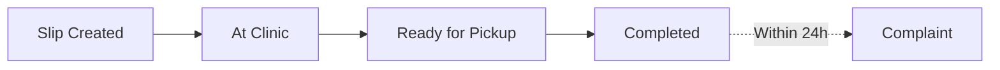

# 🧺 Loondry

<div align="center">

**Laundry Management, Engineered.**

A full-stack workflow system that digitizes traditional laundry clinic operations with smart slip management, queue tracking, and OTP verification.

[](/)
[](/)
[](/)

[Live Demo](#) • [Features](#-features) • [Installation](#-installation) • [Documentation](#-documentation)

</div>

---

## 📖 Overview

Loondry transforms the traditional paper-based laundry slip system into a modern, trackable digital workflow. Built for real-world laundry clinics, it manages the complete lifecycle of laundry orders—from slip creation to pickup—with live status updates, queue management, and secure OTP verification.

### The Problem

Traditional laundry clinics face several operational challenges:

- 📝 Manual paper-based slip management
- ❌ No order tracking or status visibility
- ⏳ Unpredictable queue times
- 🔍 Lost slips break the entire process
- 📞 Excessive customer service calls

### The Solution

**A smart digital slip system** that:
- ✅ Digitizes the entire slip lifecycle
- 📊 Provides real-time status tracking
- 🔐 Secures pickup with OTP verification
- 📈 Manages queues intelligently
- 💬 Enables complaint management

---

## ✨ Features

### 👤 **Customer Portal**

| Feature | Description |
|---------|-------------|
| 📋 **Slip Creation** | Create Regular or Paid service slips with detailed item listing |
| ✏️ **Slip Editing** | Modify slip details before clinic acceptance |
| 📍 **Live Tracking** | Real-time status updates through the entire lifecycle |
| ⏱️ **Queue Visibility** | See estimated queue position and wait time |
| 🔐 **OTP Pickup** | Secure collection with one-time password verification |
| 📢 **Complaint System** | Raise issues within 24 hours of completion |

### 🛠️ **Admin Dashboard**

| Feature | Description |
|---------|-------------|
| 📊 **Status Dashboard** | Filter and view slips by current lifecycle stage |
| 🔍 **Smart Search** | Quick lookup by bag number or customer details |
| ✅ **Approval System** | Review and approve/reject incoming slips |
| 🔄 **Workflow Management** | Move slips through lifecycle stages |
| 📈 **Queue Analytics** | Monitor and manage service queues |
| 💬 **Complaint Handling** | Review and resolve customer complaints |

### 🎨 **Landing Experience**

- 🎬 Scroll-triggered animations powered by Framer Motion
- 📍 Interactive timeline visualizing the slip lifecycle
- 🎯 Animated hero section with floating laundry items
- 📱 Fully responsive storytelling layout

---

## 🏗️ Tech Stack

<div align="center">

### Frontend


### Backend


</div>

---

## 🔄 Slip Lifecycle



Each stage is:
- 🔐 **Admin Controlled** - Only authorized staff can progress slips
- 👁️ **User Visible** - Customers see real-time updates
- 📊 **Queue Aware** - System tracks position in service queue
- 🔒 **OTP Protected** - Secure verification at pickup
- 📈 **Trackable** - Complete audit trail maintained

---

## 📂 Project Structure

```
Loondry/
├── Backend/
│   ├── src/
│   │   ├── config/          # Database & Redis configuration
│   │   ├── controller/      # Business logic handlers
│   │   ├── jobs/            # Background tasks (slip cleanup)
│   │   ├── middleware/      # Auth & validation
│   │   ├── models/          # MongoDB schemas
│   │   ├── routes/          # API endpoints
│   │   ├── utils/           # Validators & helpers
│   │   └── index.js         # Server entry point
│   └── package.json
│
├── Frontend/
│   ├── src/
│   │   ├── assets/          # Images & SVG icons
│   │   ├── components/      # React components
│   │   │   ├── adminSlip/   # Admin workflow components
│   │   │   ├── userSlip/    # User slip components
│   │   │   ├── Complain/    # Complaint system
│   │   │   ├── LandingPage/ # Marketing pages
│   │   │   └── Home/        # Dashboard components
│   │   ├── layouts/         # Page layouts
│   │   ├── pages/           # Route pages
│   │   ├── store/           # Redux state management
│   │   ├── utils/           # Axios & helpers
│   │   └── App.jsx
│   └── package.json
│
└── README.md
```

---

## 🚀 Installation

### Prerequisites

- Node.js (v16 or higher)
- MongoDB (v5 or higher)
- Redis (v6 or higher)

### 1. Clone Repository

```bash
git clone https://github.com/Advitiyyaaa/Loondry.git
cd Loondry
```

### 2. Backend Setup

```bash
cd Backend
npm install
```

Create `.env` file:

```env
# Database
MONGO_URI=mongodb://localhost:27017/loondry

# Authentication
JWT_SECRET=your_super_secret_jwt_key_here

# Cache
REDIS_URL=redis://localhost:6379

# Server
PORT=5000
NODE_ENV=development
```

Start the backend:

```bash
npm run dev
```

### 3. Frontend Setup

```bash
cd Frontend
npm install
```

Create `.env` file:

```env
VITE_API_URL=http://localhost:5000/api
```

Start the development server:

```bash
npm run dev
```

### 4. Access Application

- **Frontend**: http://localhost:5173
- **Backend API**: http://localhost:5000
- **Admin Panel**: Register first admin through `/api/admin/register`

---

## 🎯 Business Rules

These constraints ensure data integrity and reflect real-world laundry operations:

| Rule | Description |
|------|-------------|
| 📌 **One Active Regular Slip** | Users can only have one pending regular slip at a time |
| 👕 **Minimum Items** | Regular slips must contain at least one clothing item |
| 💰 **Paid Items Only** | Paid slips must contain at least one paid service item |
| ➡️ **Forward-Only Progression** | Slip status can only advance, never regress |
| 🔐 **OTP Required** | Pickup requires valid one-time password |
| ⏰ **24-Hour Complaint Window** | Complaints must be filed within 1 day of completion |
| 📊 **Queue Calculation** | Based on slips in "Slip Created" status |

---

## 🔌 API Endpoints

### Authentication
```
POST   /user/register                   # User registration
POST   /user/login                      # User/admin login
POST   /user/admin/register             # Admin registration
POST   /user/bagNumber/change           # Bag Number change
```

### Slips
```
GET    /slip/queue-count                # Get current queue size before visiting clinic
GET    /slip/my                         # Get all slips of logged-in user
GET    /slip/:id                        # Get single slip details by ID

POST   /slip/create                     # Create a new slip (Regular / Paid)
PUT    /slip/update/:id                 # Update clothes/items before approval
DELETE /slip/delete/:id                 # Delete slip (only when allowed)

GET    /slip/admin/all                  # Get all slips with filters

PUT    /slip/admin/approve/:id          # Approve slip (Slip-Created → At Clinic)
PUT    /slip/admin/ready/:id            # Mark slip Ready for Pickup
PUT    /slip/admin/complete/:id         # Complete slip using OTP verification

DELETE /slip/admin/reject/:id           # Reject & delete slip

```

### Complaints
```
POST   /complain/create                 # Create a new complaint (within 1 day of completion)
GET    /complain/my                     # Get all complaints of logged-in user
GET    /complain/:id                    # Get single complaint details

GET    /complain/admin/all              # Get all complaints
PUT    /complain/admin/resolve/:id      # Mark complaint as resolved
```

---

## 🎨 UI Components

### Slip Cards
- **Regular Slip**: Standard laundry service
- **Paid Slip**: Premium services (ironing, dry cleaning, etc.)
- **Status Badges**: Visual indicators for each lifecycle stage

### Admin Views
- **Dashboard**: Filterable grid of all active slips
- **Queue View**: Real-time queue status and metrics
- **Complaint Manager**: Centralized complaint handling

### Animations
- Scroll-triggered reveals using Framer Motion
- Floating clothes animation in hero section
- Smooth status transition indicators

---
## 👨‍💻 Author

**Advitiyya**

- GitHub: [@Advitiyyaaa](https://github.com/Advitiyyaaa)
- Project Link: [Loondry](https://github.com/Advitiyyaaa/Loondry)

---

## 🙏 Acknowledgments

- Inspired by real-world laundry clinic operations
- Built with modern web technologies
- Designed for scalability and user experience

---

<div align="center">

**Made with ❤️ and lots of ☕**

⭐ Star this repo if you find it helpful!

</div>